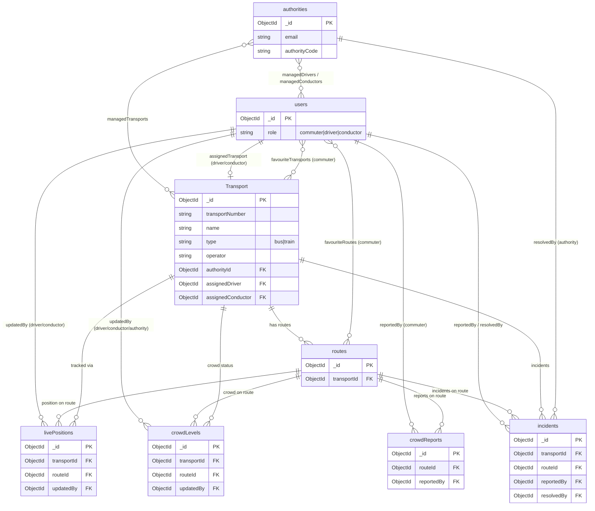
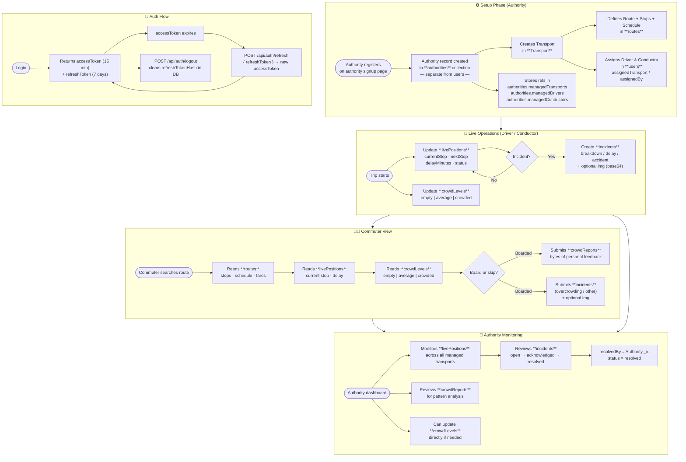

# Database Schema — Public Transport Information & Crowd Insights

> MongoDB Collections · Roles: `commuter` · `authority` · `driver` · `conductor`

---

## Table of Contents

1. [Collections at a Glance](#1-collections-at-a-glance)
2. [users](#2-users)
3. [authorities](#3-authorities)
4. [transports](#4-transports)
5. [routes](#5-routes)
6. [livePositions](#6-livepositions)
7. [crowdLevels](#7-crowdlevels)
8. [crowdReports](#8-crowdreports)
9. [incidents](#9-incidents)
10. [Enum Reference](#10-enum-reference)
11. [Entity Relationships](#11-entity-relationships)
12. [System Data Flow](#12-system-data-flow)
13. [API Pagination & Token Refresh](#13-api-pagination--token-refresh)

---

## 1. Collections at a Glance

| Collection | Primary Purpose | Written By | Read By |
|---|---|---|---|
| `users` | Identity & role for every person | Self-register / Authority | Everyone |
| `authorities` | Organisation profile for an authority user | Authority | Authority, Admin |
| `transports` | Vehicle / service entity (bus or train) | Authority | Everyone |
| `routes` | Static stops, schedule, fares for a transport | Authority | Everyone |
| `livePositions` | Real-time location & delay of a running transport | Driver · Conductor | Everyone |
| `crowdLevels` | Official crowd status of a running transport | Driver · Conductor · Authority | Everyone |
| `crowdReports` | Crowd feedback submitted by commuters | Commuter | Authority |
| `incidents` | Breakdown / delay / accident reports | Commuter · Driver · Conductor | Authority |

---

## 2. users

> Stores commuters, drivers, and conductors. **Authorities are NOT in this table** — they have their own separate `authorities` collection.

| Field | Type | Notes |
|---|---|---|
| `_id` | ObjectId | Primary key |
| `name` | String | Display name |
| `email` | String | **Unique · Indexed** |
| `passwordHash` | String | bcrypt — **never sent to frontend** · `select: false` |
| `role` | String | enum → [see §10](#10-enum-reference) |
| `phone` | String | Optional contact |
| `favouriteTransports` | [ObjectId] | ref: `Transport` — **commuter only** |
| `favouriteRoutes` | [ObjectId] | ref: `Route` — **commuter only** |
| `assignedTransport` | ObjectId | ref: `Transport` — **driver / conductor only** |
| `assignedBy` | ObjectId | ref: `authorities` (Authority who assigned) |
| `assignedAt` | Date | When assignment was made |
| `isActive` | Boolean | Soft-disable without deleting |
| `refreshTokenHash` | String | bcrypt hash of current refresh token — **never sent to frontend** · `select: false` · `null` when logged out |
| `createdAt` | Date | Auto-managed |
| `updatedAt` | Date | Auto-managed |

---

## 3. authorities

> **Standalone identity — separate from `users`.** Authorities sign up on their own page and are stored here only, never in the `users` collection. Has its own authentication fields.

| Field | Type | Notes |
|---|---|---|
| `_id` | ObjectId | Primary key |
| `name` | String | Authority admin's display name |
| `email` | String | **Unique · Indexed** — used for login |
| `passwordHash` | String | bcrypt — **never sent to frontend** · `select: false` |
| `phone` | String | Optional contact |
| `isActive` | Boolean | Soft-disable without deleting |
| `refreshTokenHash` | String | bcrypt hash of current refresh token — `select: false` · `null` when logged out |
| `organizationName` | String | e.g. `"Tamil Nadu State Transport"` |
| `authorityCode` | String | **Unique** e.g. `"TNSTC-NTH"` |
| `region` | String | e.g. `"Salem"` |
| `coveredDistricts` | [String] | e.g. `["Salem","Namakkal","Dharmapuri"]` |
| `contactEmail` | String | Official contact email |
| `contactPhone` | String | Official contact phone |
| `officeAddress` | String | Physical address |
| `managedTransports` | [ObjectId] | ref: `Transport` |
| `managedDrivers` | [ObjectId] | ref: `users` (role: driver) |
| `managedConductors` | [ObjectId] | ref: `users` (role: conductor) |
| `createdAt` | Date | Auto-managed |
| `updatedAt` | Date | Auto-managed |

---

## 4. transports

> Represents a bus or train as a vehicle/service entity. Managed entirely by an authority.

| Field | Type | Notes |
|---|---|---|
| `_id` | ObjectId | Primary key |
| `transportNumber` | String | **Unique within authority** · e.g. `"SLM-001"`, `"12A"`, `"Express-7"` |
| `name` | String | e.g. `"Salem–Chennai Express"` |
| `type` | String | enum → [see §10](#10-enum-reference) |
| `operator` | String | e.g. `"TNSTC"`, `"Southern Railway"` · optional |
| `authorityId` | ObjectId | ref: `authorities` — who manages this · **required** |
| `amenities` | [String] | e.g. `["AC", "WiFi", "Sleeper"]` · optional |
| `totalSeats` | Number | Total seating capacity · optional |
| `vehicleNumber` | String | Physical plate/registration · optional |
| `assignedDriver` | ObjectId | ref: `users` (role: driver) · `null` if unassigned |
| `assignedConductor` | ObjectId | ref: `users` (role: conductor) · `null` if unassigned |
| `isActive` | Boolean | Soft-disable without deleting |
| `createdAt` | Date | Auto-managed |
| `updatedAt` | Date | Auto-managed |

> **Compound unique index:** `{ transportNumber, authorityId }` — the same transport number can exist under different authorities.

---

## 5. routes

> Defines the full schedule, stops, and fare table for one transport's journey.

### Core fields

| Field | Type | Notes |
|---|---|---|
| `_id` | ObjectId | Primary key |
| `transportId` | ObjectId | ref: `Transport` |
| `routeNumber` | String | e.g. `"RT-001"` |
| `routeName` | String | e.g. `"Salem → Chennai"` |
| `origin` | String | e.g. `"Salem"` |
| `destination` | String | e.g. `"Chennai"` |
| `direction` | String | enum: `forward` · `return` |
| `totalDistance` | Number | kilometres |
| `estimatedDuration` | Number | minutes |
| `availableSeats` | Number | Current available seats (computed or manual) |
| `createdAt` | Date | |
| `updatedAt` | Date | |

### stops[ ] — sub-document array

| Sub-field | Type | Notes |
|---|---|---|
| `stopName` | String | e.g. `"Krishnagiri"` |
| `stopOrder` | Number | 1, 2, 3 … |
| `distanceFromOrigin` | Number | km |
| `scheduledArrival` | String | `"HH:MM"` e.g. `"09:45"` |
| `scheduledDeparture` | String | `"HH:MM"` e.g. `"09:50"` |
| `platformNumber` | String | Trains only — optional |

### schedule[ ] — sub-document array

| Sub-field | Type | Notes |
|---|---|---|
| `tripId` | String | e.g. `"SLM-CHN-0900"` |
| `departureTime` | String | `"09:00"` from origin |
| `arrivalTime` | String | `"13:30"` at destination |
| `daysOfOperation` | [String] | `["Mon","Tue","Wed","Thu","Fri","Sat","Sun"]` |
| `isActive` | Boolean | Whether trip is currently running |

### fareTable[ ] — sub-document array

| Sub-field | Type | Notes |
|---|---|---|
| `fromStop` | String | Origin stop name |
| `toStop` | String | Destination stop name |
| `fare` | Number | Amount in ₹ |
| `fareClass` | String | enum: `general` · `AC` · `sleeper` |

### Route Example

```
forward:  Salem(09:00) → Krishnagiri(10:10) → Vellore(11:30) → Chennai(13:30)
return:   Chennai(14:00) → Vellore(16:00) → Krishnagiri(17:20) → Salem(18:30)

fareTable:
  Salem → Chennai        ₹180   general
  Salem → Krishnagiri    ₹60    general
  Salem → Vellore        ₹120   general
  Krishnagiri → Chennai  ₹130   general
```

---

## 6. livePositions

> Updated in real-time by the driver or conductor aboard the transport.

| Field | Type | Notes |
|---|---|---|
| `_id` | ObjectId | Primary key |
| `transportId` | ObjectId | ref: `Transport` |
| `routeId` | ObjectId | ref: `Route` |
| `tripId` | String | Which schedule trip is running |
| `currentStop` | String | e.g. `"Krishnagiri"` |
| `nextStop` | String | e.g. `"Vellore"` |
| `stopIndex` | Number | Index into `stops[]` |
| `delayMinutes` | Number | `0` = on time |
| `status` | String | enum: `on-time` · `delayed` · `cancelled` · `completed` |
| `updatedByModel`| String | enum: `User` · `Authority` |
| `updatedBy` | ObjectId | ref: `updatedByModel` |
| `updatedByRole` | String | enum: `driver` · `conductor` · `authority` |
| `updatedAt` | Date | Timestamp of last update |

---

## 7. crowdLevels

> Official crowd status. Only three values are ever exposed to commuters.
> ⚠️ Fields `passengerCount`, `totalCapacity`, and `seatCount` must **never** be added here.

| Field | Type | Notes |
|---|---|---|
| `_id` | ObjectId | Primary key |
| `transportId` | ObjectId | ref: `Transport` |
| `routeId` | ObjectId | ref: `Route` |
| `tripId` | String | Running trip identifier |
| `crowdLevel` | String | enum: **`empty`** · **`average`** · **`crowded`** |
| `currentStop` | String | Stop at the time of update |
| `updatedByModel`| String | enum: `User` · `Authority` |
| `updatedBy` | ObjectId | ref: `updatedByModel` |
| `updatedByRole` | String | enum: `driver` · `conductor` · `authority` |
| `updatedAt` | Date | Timestamp |

---

## 8. crowdReports

> Crowd feedback submitted voluntarily by commuters.

| Field | Type | Notes |
|---|---|---|
| `_id` | ObjectId | Primary key |
| `routeId` | ObjectId | ref: `Route` |
| `reportedBy` | ObjectId | ref: `users` (**commuter only**) |
| `crowdLevel` | String | enum: `empty` · `average` · `crowded` |
| `boardingStop` | String | Where the commuter boarded |
| `reportedAt` | Date | Submission timestamp |

---

## 9. incidents

> Disruption reports. Raised by commuters, drivers, or conductors. Resolved by authority.

| Field | Type | Notes |
|---|---|---|
| `_id` | ObjectId | Primary key |
| `transportId` | ObjectId | ref: `Transport` |
| `routeId` | ObjectId | ref: `Route` |
| `reportedBy` | ObjectId | ref: `users` |
| `reporterRole` | String | enum → [see §10](#10-enum-reference) |
| `incidentType` | String | enum → [see §10](#10-enum-reference) |
| `severity` | String | enum → [see §10](#10-enum-reference) |
| `description` | String | Free text — optional |
| `location` | String | e.g. `"Between Krishnagiri and Vellore"` |
| `status` | String | enum → [see §10](#10-enum-reference) |
| `img` | String | Optional base64 photo evidence — format: `data:image/<type>;base64,...` · Supported types: `jpeg` `jpg` `png` `gif` `webp` · **never stored as a file, only as inline base64 string** |
| `resolvedBy` | ObjectId | ref: `users` (**authority only**) |
| `resolvedAt` | Date | When resolved |
| `reportedAt` | Date | Submission timestamp |
| `updatedAt` | Date | Last status change |

> **img field usage example (POST body):**
> ```json
> {
>   "transportId": "...",
>   "routeId": "...",
>   "incidentType": "breakdown",
>   "img": "data:image/jpeg;base64,/9j/4AAQSkZJRgAB..."
> }
> ```

---

## 10. Enum Reference

> All enum values used across the schema, gathered in one place for easy reference.

### users · `role`
| Value | Description |
|---|---|
| `commuter` | Regular passenger — can search, favourite, report crowd/incidents |
| `driver` | Assigned by authority — updates live position & crowd level |
| `conductor` | Assigned by authority — updates live position & crowd level |

> **Note:** Authorities are NOT a role in `users`. Authorities are their own collection with their own login.

### Transport · `type`
| Value | Description |
|---|---|
| `bus` | Road-based public bus |
| `train` | Rail-based transport |

### routes · `direction`
| Value | Description |
|---|---|
| `forward` | Origin → Destination (outbound) |
| `return` | Destination → Origin (inbound) |

### routes → fareTable · `fareClass`
| Value | Description |
|---|---|
| `general` | Standard seating |
| `AC` | Air-conditioned compartment |
| `sleeper` | Sleeper berth (train only) |

### routes → schedule · `daysOfOperation`
| Value | Description |
|---|---|
| `Mon` `Tue` `Wed` `Thu` `Fri` `Sat` `Sun` | Day abbreviations — any subset is valid |

### livePositions · `status`
| Value | Description |
|---|---|
| `on-time` | Running as scheduled |
| `delayed` | Behind schedule by `delayMinutes` |
| `cancelled` | Trip cancelled for the day |
| `completed` | Trip has reached final destination |

### livePositions / crowdLevels · `updatedByRole`
| Value | Description |
|---|---|
| `driver` | |
| `conductor` | |
| `authority` | `crowdLevels` only |

### crowdLevels / crowdReports · `crowdLevel`
| Value | Description |
|---|---|
| `empty` | Plenty of seats available |
| `average` | Moderately occupied |
| `crowded` | Heavily crowded, standing room only |

### incidents · `reporterRole`
| Value | Description |
|---|---|
| `commuter` | |
| `driver` | |
| `conductor` | |

### incidents · `incidentType`
| Value | Description |
|---|---|
| `delay` | Transport is running late |
| `breakdown` | Mechanical failure |
| `accident` | Collision or safety event |
| `overcrowding` | Dangerously crowded |
| `other` | Any other issue |

### incidents · `severity`
| Value | Description |
|---|---|
| `low` | Minor, no immediate action needed |
| `medium` | Noteworthy, monitor the situation |
| `high` | Significant disruption |
| `critical` | Safety risk, immediate authority action required |

### incidents · `status`
| Value | Description |
|---|---|
| `open` | Just reported, not yet reviewed |
| `acknowledged` | Authority has seen it |
| `resolved` | Issue closed by authority |

### incidents · `img` (base64 MIME types)
| Accepted prefix | Format |
|---|---|
| `data:image/jpeg;base64,` | JPEG |
| `data:image/jpg;base64,` | JPG |
| `data:image/png;base64,` | PNG |
| `data:image/gif;base64,` | GIF |
| `data:image/webp;base64,` | WebP |

---

## 11. Entity Relationships



---

## 12. System Data Flow



---

## 13. API Pagination & Token Refresh

### Pagination

All list endpoints return a standard `pagination` object:

```json
{
  "success": true,
  "data": {
    "incidents": [ ... ],
    "pagination": {
      "total": 87,
      "page": 2,
      "limit": 20,
      "pages": 5
    }
  }
}
```

| Endpoint | Pagination query params |
|---|---|
| `GET /api/incidents` | `page`, `limit`, `status`, `severity`, `transportId`, `incidentType` |
| `GET /api/incidents/:transportId` | `page`, `limit`, `status`, `severity`, `incidentType` |
| `GET /api/transport/search` | `page`, `limit`, `busNo`, `type`, `origin`, `destination`, `departureTime`, `authorityId`, `myTransports` |

Defaults: `page = 1`, `limit = 20`. Maximum `limit = 100`.

---

### Token Refresh Flow

Auth now uses **two tokens**:

| Token | Expiry | Where stored | Purpose |
|---|---|---|---|
| `accessToken` | 15 minutes | `localStorage` / memory | Sent as `Authorization: Bearer <token>` on every API call |
| `refreshToken` | 7 days | `localStorage` (securely) | Sent once to `/api/auth/refresh` to get a new accessToken |

**Endpoints:**

| Method | Endpoint | Auth | Body | Returns |
|---|---|---|---|---|
| `POST` | `/api/auth/login` | Public | `{ email, password }` | `{ accessToken, refreshToken, user }` |
| `POST` | `/api/auth/refresh` | Public | `{ refreshToken }` | `{ accessToken, refreshToken, user }` — token is **rotated** |
| `POST` | `/api/auth/logout` | Bearer accessToken | — | Clears `refreshTokenHash` in DB |

> **Rotation:** Each call to `/api/auth/refresh` issues a brand-new refresh token and invalidates the old one (stored as bcrypt hash in `users.refreshTokenHash`). Logging out sets the hash to `null`.

---

### Authority Scoping on Transport Search

`GET /api/transport/search` accepts two extra params for the Authority dashboard:

| Query param | Type | Description |
|---|---|---|
| `authorityId` | String | Filter transports to a specific authority ObjectId |
| `myTransports` | `"true"` | When `true` and the logged-in user is an authority, automatically scopes results to **their own** transports |

Commuter search usage (no scoping):
```
GET /api/transport/search?origin=Salem&destination=Chennai&page=1&limit=20
```

Authority dashboard usage (own transports only):
```
GET /api/transport/search?myTransports=true&page=1&limit=50
```

---

### Quick Reference — Who Writes What

| Collection | commuter | authority | driver | conductor |
|---|:---:|:---:|:---:|:---:|
| `users` | ✅ (own) | ✅ (own + assigns staff) | ✅ (own) | ✅ (own) |
| `authorities` | ❌ | ✅ | ❌ | ❌ |
| `transports` | ❌ | ✅ | ❌ | ❌ |
| `routes` | ❌ | ✅ | ❌ | ❌ |
| `livePositions` | ❌ | ✅ | ✅ | ✅ |
| `crowdLevels` | ❌ | ✅ | ✅ | ✅ |
| `crowdReports` | ✅ | ❌ | ❌ | ❌ |
| `incidents` | ✅ | ❌ (resolves only) | ✅ | ✅ |

### Quick Reference — Who Reads What

| Collection | commuter | authority | driver | conductor |
|---|:---:|:---:|:---:|:---:|
| `transports` | ✅ | ✅ | ✅ | ✅ |
| `routes` | ✅ | ✅ | ✅ | ✅ |
| `livePositions` | ✅ | ✅ | ✅ | ✅ |
| `crowdLevels` | ✅ | ✅ | ✅ | ✅ |
| `crowdReports` | ❌ | ✅ | ❌ | ❌ |
| `incidents` | own only | ✅ all | own only | own only |
| `authorities` | ❌ | ✅ | ❌ | ❌ |
